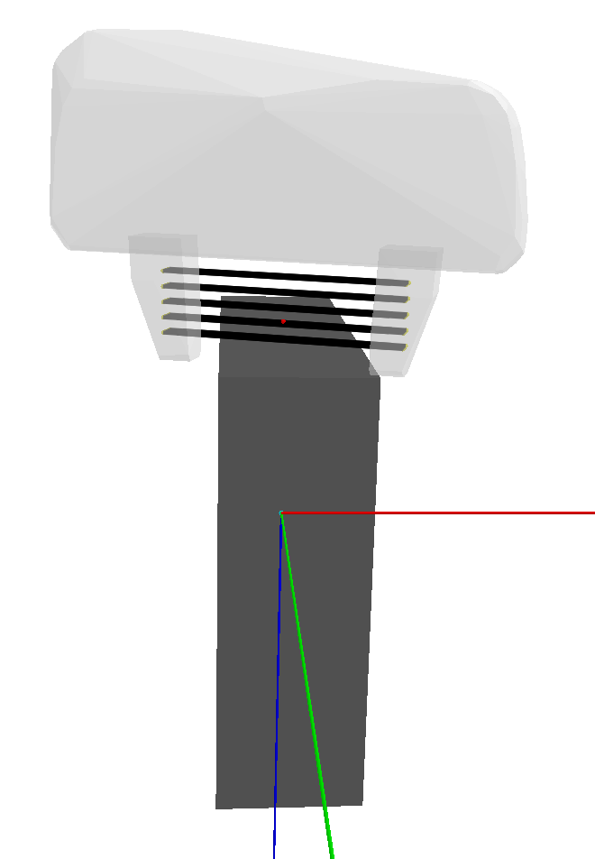
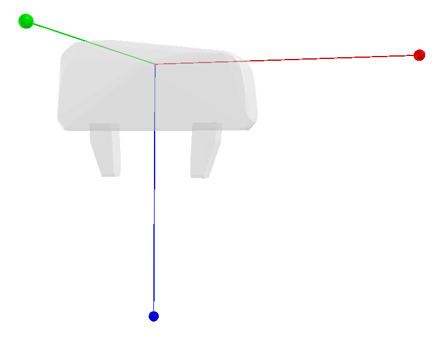
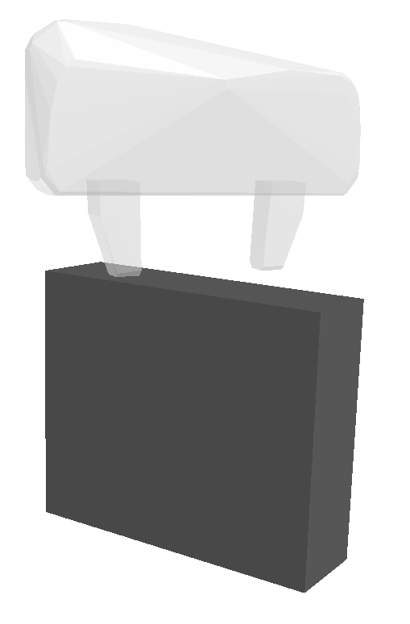

# GraspSampler
GraspSampler is a library that performs efficient sampling of millions of parallel-jaw grasps around a target object object. One can quickly generate a dataset that contains numerous grasps and their quality scores.

This library supports visualization of grasps, grippers and objects, rendering of 3D point clouds, and efficient sampling of parallel-jaw grasps. The tutorials show examples using a Franka-Emika Gripper and a target object.


<!-- Grasp Definition -->

## Installation
GraspSampler was created using Ubuntu 18.04 and python 3.8. To install GraspSampler on your local machine follow [these intstructions.](https://github.com/patrickeala/Grasp-Sampler/blob/main/documentation/installation.md)

Once you have a working environment for GraspSampler, you can try the tutorials in the next section.

## Tutorials
The following are tutorials on how to use the different features of GraspSampler.

### Tutorial 1: Gripper Definitiion
This tutorial shows how to load a gripper into the scene and manipulate its position. 
Run the gripper tutorial:
```
python -m tutorials.gripper
```


### Tutorial 2: Adding Target Object 
This tutorial shows how to add a target object into the scene.
Run the target object tutorial:
```
python -m tutorials.object
```



### Tutorial 3: Visualizing Object Point Clouds
This tutorial shows how to generate a point cloud from an object in the scene.
Run the point cloud tutorial:
```
python -m tutorials.pc_manager
```

### Tutorial 4: Sampling Grasps
This tutorial loads an object and samples multiple grasps about that object.
Run the grasp sampler tutorial:
```
python -m tutorials.graspsampler
```


<!-- ## XXX -->
